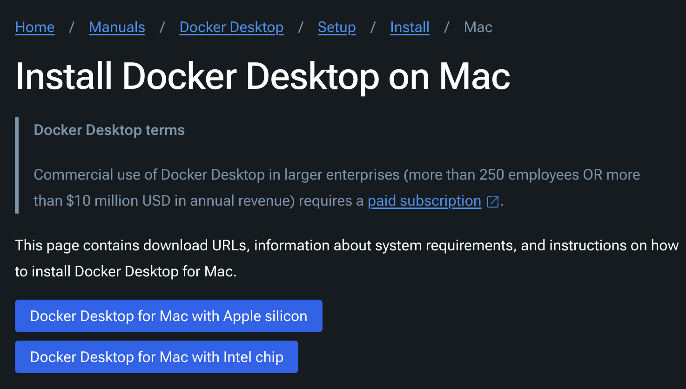
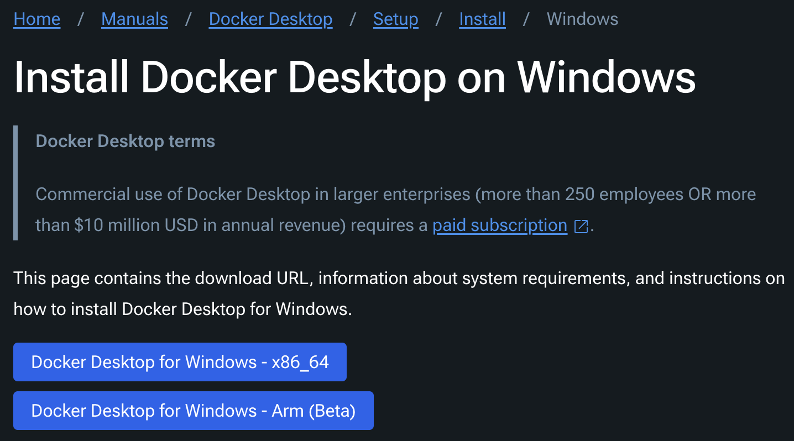
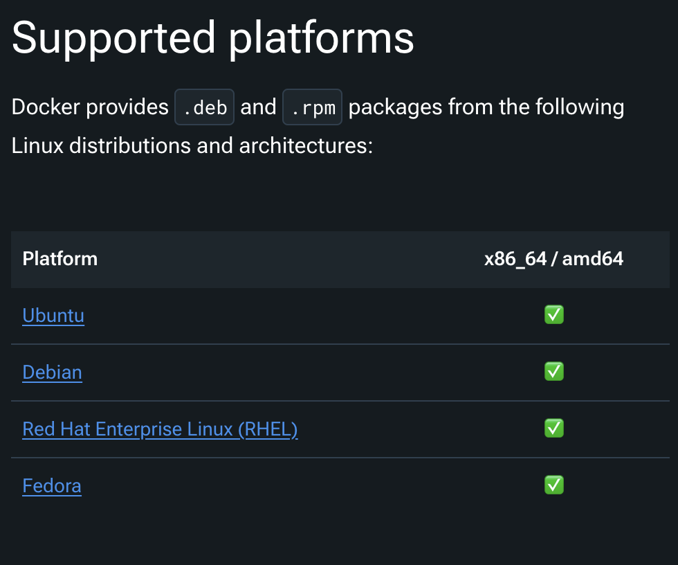
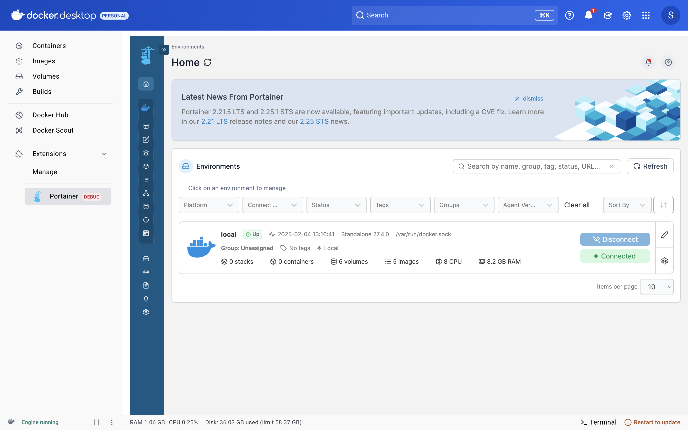
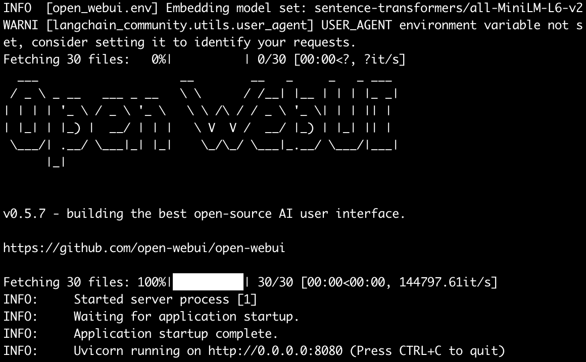
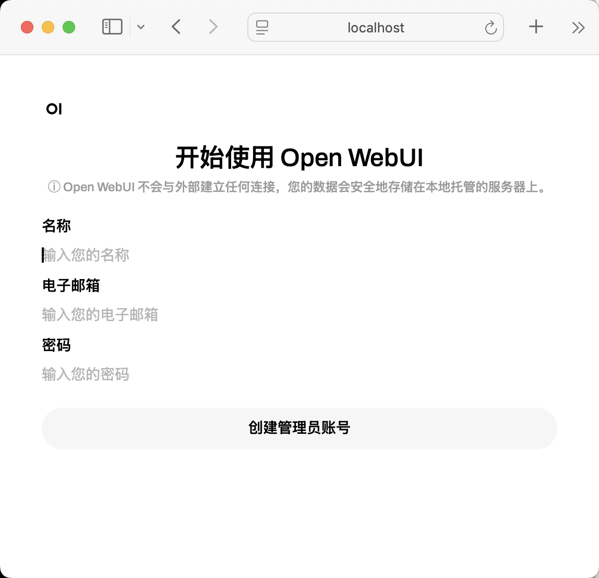
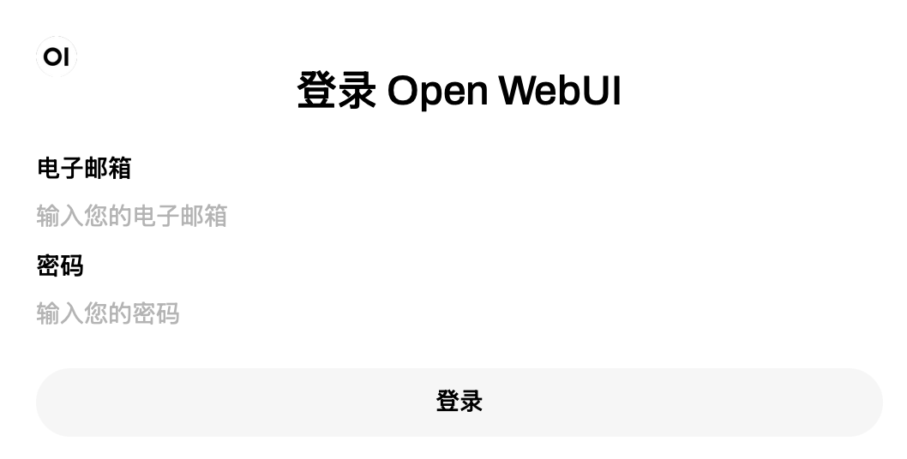
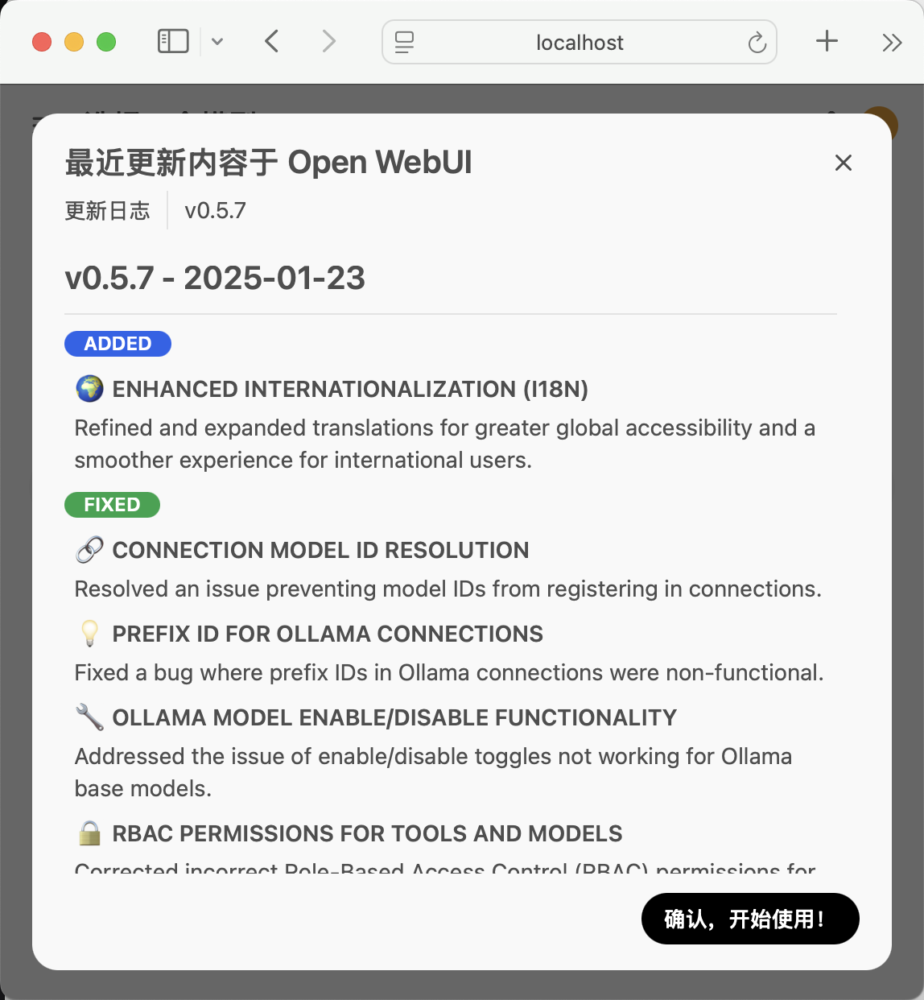
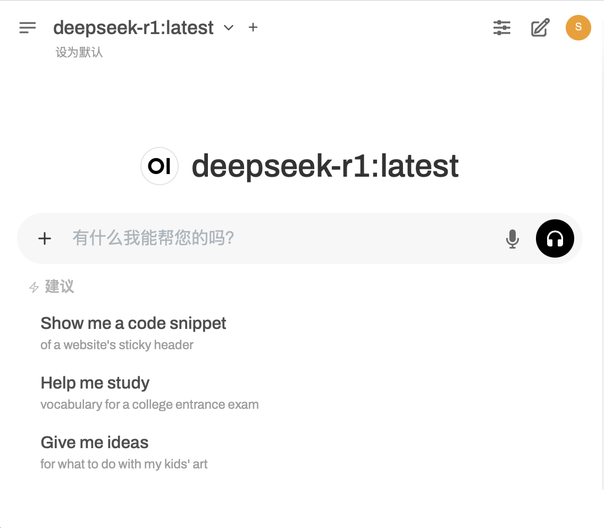

# 手把手搭建DeepSeek本地大模型


## 大型语言模型（LLM）


大型语言模型（Large Language Models，简称LLM），是一种基于深度学习的自然语言处理模型，通过大规模语料库的训练，能够生成、理解和处理复杂的文本数据。

这里要把最近火出圈的[DeepSeek](https://www.deepseek.com/)装进自己的电脑里。

## Ollama

Ollama是一个开源的工具，旨在简化大型语言模型的部署和运行过程，使得用户可以在本地环境中使用高质量的语言模型。

在终端执行以下代码，将Ollama部署到本机。

``` shell
curl -fsSL https://ollama.com/install.sh | sh
```

### Ollama命令

Ollama命令参考如下，一般情况下，我们会用`ollama run <LLM>`就足够用了。


| 命令            | 作用                         |
|-----------------|------------------------------|
| `ollama serve`  | 启动 ollama                   |
| `ollama create` | 从模型文件创建模型            |
| `ollama show`   | 显示模型信息                  |
| `ollama run`    | 运行模型                      |
| `ollama pull`   | 从注册表中拉取模型            |
| `ollama push`   | 将模型推送到注册表            |
| `ollama list`   | 列出模型                      |
| `ollama ps`     | 列出运行的模型                |
| `ollama cp`     | 复制模型                      |
| `ollama rm`     | 删除模型                      |
| `ollama help`   | 获取有关任何命令的帮助信息    |

## 部署DeepSeek-R1模型

DeepSeek-R1是最近发布的大模型，号称超越ChatGPT-4o。

为方便演示，使用DeepSeek-R1的1.5B小参数集模型。

执行以下代码，拉取DeepSeek-R1:1.5B版本

``` shell
ollama pull deepseek-r1:1.5b
```

``` tex
pulling manifest
pulling aabd4debf0c8... 100% ▕████████████████▏ 1.1 GB
pulling 369ca498f347... 100% ▕████████████████▏  387 B
pulling 6e4c38e1172f... 100% ▕████████████████▏ 1.1 KB
pulling f4d24e9138dd... 100% ▕████████████████▏  148 B
pulling a85fe2a2e58e... 100% ▕████████████████▏  487 B
verifying sha256 digest
writing manifest
success
```

现在可以跟DeepSeek聊天了，启动Ollama并运行DeepSeek-R1大模型。

``` shell
ollama run deepseek-r1 "一句话总结哪吒闹海的故事"
```

``` tex
<think>
嗯，我现在要总结一下《哪吒闹海》这个故事。首先，我得回忆一下这个故事的主要情节
和主题是什么。

故事讲的是哪吒在海里遇到危险，被龙王派去镇压，结果没成功，最后回到 land 上找人
帮忙。对吧？然后他在东海龙宫附近遇到了黄龙、白龙这些小精灵，他们帮助他克服了各
种困难。我记得其中有一个关键点是哪吒救了金角和银角，这两只巨兽，后来他们被奖励
给了哪吒。这可能也是故事的重要部分。

另外，哪吒的形象比较独特，他既有 strength, 又有 cleverness 和智慧，这点在故事
中得到了体现。他的勇敢和机智让他的朋友觉得他很值得信赖，甚至愿意牺牲自己的生命
去保护他。

总的来说，这个故事的主题应该是友谊、勇气和正义。哪吒通过合作和智慧赢得了战斗，
并且也帮助了其他人，特别是金角和银角。所以，总结的时候应该涵盖这些要点：哪吒在
闹海中遇到困难，被龙王派去镇压，最终失败并得到黄龙等的帮助，恢复力量后救出巨兽
，恢复了力量，并从中学会了友谊、勇气和正义。

现在，把这些点组织成一句话，可能需要涵盖主要事件和主题。例如，“哪吒闹海的故事
讲述了一个勇敢的少年在面对强大的敌人时，依靠智慧和友谊克服困难并恢复力量，体现
了勇气、友谊和正义的主题。” 这样应该能全面且简洁地总结故事。
</think>

《哪吒闹海》讲述了一位勇敢的少年在面对强大敌人时，凭借智慧与友谊克服困难，最终
恢复力量，并展现了勇气、友谊和正义的主题。
```

看来DeepSeek还有点中英文杂合的特色，可能1.5B版本模型还差些火候，有待优化。

## 搭建Web服务

终端极客版本的大模型用起来看着不那么友好，还是Web界面操作更有亲和力。

### 部署Docker

附上Docker桌面版下载（命令安装）地址：
- [Mac版本下载](https://docs.docker.com/desktop/setup/install/mac-install/)  
- [Windows版本下载](https://docs.docker.com/desktop/setup/install/windows-install/)  
- [Linux版本命令安装](https://docs.docker.com/desktop/setup/install/linux/)  

注意区分CPU架构版本。





安装好Docker，只要能打开这个界面就说明Docker正常运行了。



### 部署OpenWebUI

在终端执行以下代码，拉取Open WebUI Docker镜像。

``` shell
% docker pull ghcr.io/open-webui/open-webui:main
``` 

``` tex
main: Pulling from open-webui/open-webui
7ce705000c39: Pull complete
d02d1a1ced20: Pull complete
8c2bfb64ec8e: Pull complete
1c510bbba845: Pull complete
c1b66c7e5efa: Pull complete
4f4fb700ef54: Pull complete
cef437bcef5f: Pull complete
77456adf2b22: Pull complete
815479942156: Pull complete
293c52404a14: Pull complete
b7fca0b068c8: Pull complete
b9defacaa06c: Pull complete
690490b2e7dc: Pull complete
b5f1de319771: Pull complete
40635cddd89d: Pull complete
Digest: sha256:b2c83b5c7b9b244999307b4b1c0e195d41268f3d3a62b84b470c0cea5c5743fd
Status: Downloaded newer image for ghcr.io/open-webui/open-webui:main
ghcr.io/open-webui/open-webui:main

What's next:
    View a summary of image vulnerabilities and recommendations → docker scout quickview ghcr.io/open-webui/open-webui:main
```

``` shell
docker run \
    -v open-webui:/app/backend/data \
    -e OLLAMA_BASE_URL=http://127.0.0.1:11434 \
    -p 8080:8080 \
    --name open-webui \
    --restart always ghcr.io/open-webui/open-webui:main

```

docker pull 



http://localhost:8080/










docker pull ollama/ollama

``` tex
Using default tag: latest
latest: Pulling from ollama/ollama
Digest: sha256:7e672211886f8bd4448a98ed577e26c816b9e8b052112860564afaa2c105800e
Status: Image is up to date for ollama/ollama:latest
docker.io/ollama/ollama:latest

What's next:
    View a summary of image vulnerabilities and recommendations → docker scout quickview ollama/ollama
f86ff5f88154261172e896530e3bb60a8b75df21e477fcd97c0309661f5366bc
```

``` shell

docker run -d \
    --name ollama_container \
    -p 11434:11434 ollama/ollama
```


模型名称

提供方

官网地址

说明

LLaMA3

Meta AI

https://ai.facebook.com/tools/llama/

大型语言模型，专注于高效的自然语言处理任务。

TinyLlama

开源社区

https://github.com/tinyllama

轻量级的语言模型，适用于资源受限的环境。

Qwen2/Qwen2.5

阿里云

https://qwen.ai/

多模态语言模型，支持文本和图像处理。

Phi-3

微软

https://www.microsoft.com/phi-3

小型语言模型，专注于高效能和低资源消耗。

Gemma

谷歌

https://ai.google/gemma

开源语言模型，适用于多种自然语言处理任务。

WizardLM2

微软

https://github.com/WizardLM

专注于对话生成和任务导向对话的语言模型。

Orca Mini

开源社区

https://github.com/orca-mini

小型语言模型，专注于对话生成和问答任务。

Codellama

Meta AI

https://ai.meta.com/

基于Llama 2的大型代码语言模型，提供多种版本，具备填充能力、支持大型输入上下文，以及编程任务的零样本指令跟随能力。

StarCoder2

BigCode

https://huggingface.co/docs/transformers/main/model_doc/starcoder2

代码生成模型，支持600多种编程语言。

DeepSeek Coder

DeepSeek

https://www.deepseek.com/

一个强大的代码语言模型系列，适用于代码生成、代码补全等多种任务。

LLaVA

开源社区

https://github.com/haotian-liu/LLaVA

结合了视觉编码器（如 CLIP）和大型语言模型（如 LLaMA 或 Vicuna），能够处理图像和文本的联合任务，适合高性能设备。

LLaVA-Phi3

微软 + 开源社区

https://github.com/haotian-liu/LLaVA

继承了 LLaVA 的多模态能力，同时在性能和效率上进行了优化，适合资源受限的环境。
